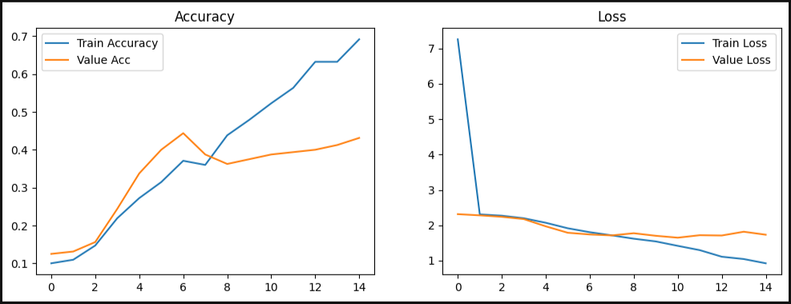
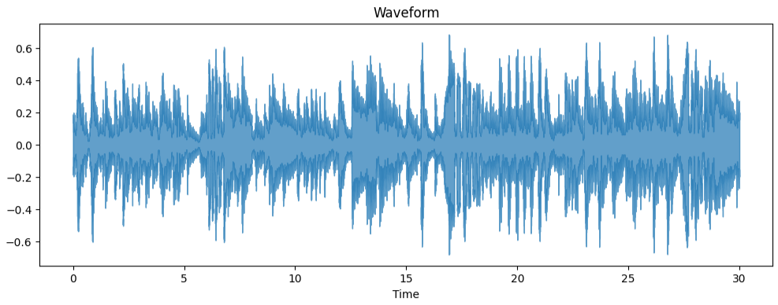
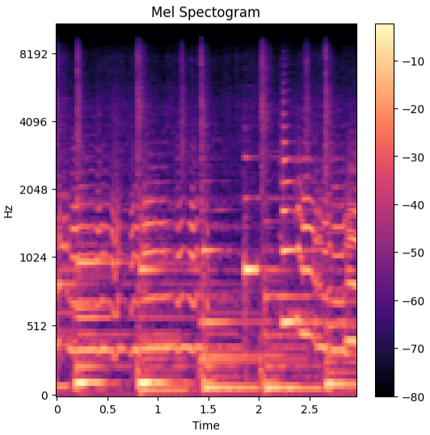
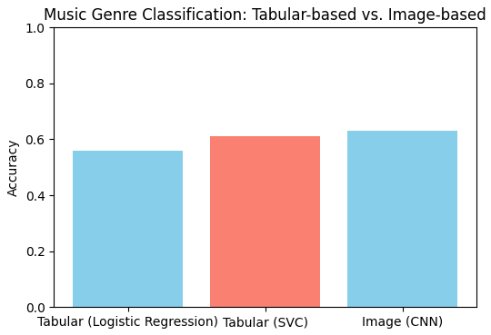
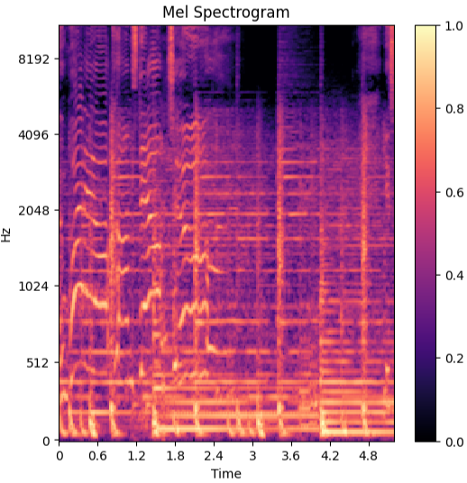

# 🎵 music-genre-classification
Music isn’t just entertainment — it’s data. Every beat, every rhythm, every frequency can be broken down into numbers. For this project, I worked on **classifying songs into genres** using the classic **GTZAN Music Genre Dataset**.  

This dataset has **1000 audio tracks** (each 30 seconds long), divided across **10 genres**: blues, classical, country, disco, hiphop, jazz, metal, pop, reggae, and rock.  

I approached the task in two main ways:  

1. **Approach A** – Traditional Machine Learning on audio features (MFCCs)  
2. **Approach B** – Deep Learning on spectrogram images using CNNs  

At the end, I compared the performance of both approaches to see which method does better for genre classification.

# 📂 Dataset
Source: https://www.kaggle.com/datasets/andradaolteanu/gtzan-dataset-music-genre-classification

# 🛠️ Tools & Libraries
- **librosa** → audio processing (extracting MFCCs, Chroma, Spectral features, etc.)  
- **pandas / numpy** → handling datasets and numerical arrays  
- **matplotlib / seaborn** → for plotting spectrograms, feature distributions, confusion matrices  
- **scikit-learn** → traditional ML models (Logistic Regression, SVM, Random Forest, XGBoost)  
- **tensorflow / keras** → building CNNs and experimenting with deep learning

# 🔹 Approach A: Tabular-based
In this approach, I focused on **hand-crafted features**. Instead of feeding raw audio to a model, I extracted meaningful features such as:

- **MFCCs (Mel Frequency Cepstral Coefficients)** → capture timbre & tone  

After extracting features, I trained several ML models:

- Logistic Regression  
- Support Vector Classifier (SVC)

# 📊 Accuracy Results:
----------------------------------
| Model               | Accuracy |
|---------------------|----------|
| Logistic Regression |   0.56   |
| SVC                 |   0.61   |
----------------------------------

# 🔹 Approach B: Image-based
Instead of extracting hand-crafted features, this approach directly uses **visual patterns** from songs.  

Steps I took:  
1. Converted audio into **Mel Spectrograms** (time-frequency images).  
2. Used a **Convolutional Neural Network (CNN)** to learn patterns.  
   - Convolutions capture shapes/edges in spectrograms  
   - Pooling reduces complexity  
   - Dense layers classify into 10 genres  

1️⃣ Train Accuracy vs. Value Accuracy & Train Loss vs. Value Loss

2️⃣ Waveform (for a Jass track):

3️⃣ Spectrogram (for a Jazz track):  

# ⚖️ Comparison of both approaches (**Tabular-based vs. Image-based**)

# 🔹 Approach B+: Transfer Learning
The idea is: instead of training a CNN from scratch, we can take a **pre-trained model** (like VGG16, ResNet50, EfficientNet) trained on ImageNet and fine-tune it on our spectrograms.  

This usually speeds up training and boosts accuracy (since spectrograms are essentially images).

